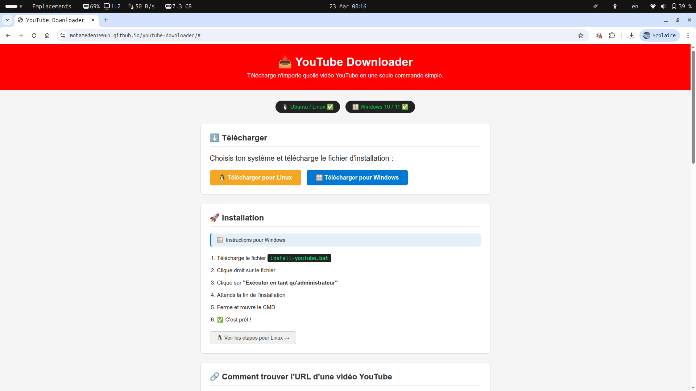

# 📥 YouTube Downloader

Télécharge n'importe quelle vidéo YouTube en une seule commande simple.

---

## ✅ Fonctionne sur

| Système | Statut |
|---------|--------|
| 🐧 Ubuntu / Linux | ✅ Supporté |
| 🪟 Windows 10 / 11 | ✅ Supporté |

---

## 🚀 Installation

> 👉 **Le plus simple : visite le site officiel qui te guide pas à pas :**
>
>
> ## **[mohameden19961.github.io/youtube-downloader](https://mohameden19961.github.io/youtube-downloader)**
>
> Le site détecte automatiquement ton système (Windows ou Linux),
> te donne le fichier à télécharger et t'explique exactement quoi faire. ✅

---

<details>
<summary>📖 Voir les instructions manuelles</summary>

### 🐧 Sur Ubuntu / Linux

**1. Télécharge le fichier `install-youtube.sh`**

**2. Ouvre le terminal dans le dossier du fichier et exécute :**

```bash
chmod +x install-youtube.sh
./install-youtube.sh
```

**3. Ferme et rouvre le terminal**

**4. C'est prêt ✅**

---

### 🪟 Sur Windows

**1. Télécharge le fichier `install-youtube.bat`**

**2. Clique droit → "Exécuter en tant qu'administrateur"**

**3. Attends la fin de l'installation**

**4. Ferme et rouvre le CMD**

**5. C'est prêt ✅**

</details>

---

## 🔗 Comment trouver l'URL d'une vidéo YouTube

**Sur navigateur :**
1. Ouvre la vidéo sur YouTube
2. Copie le lien dans la barre d'adresse

```
https://www.youtube.com/watch?v=XXXX
```

**Sur application YouTube :**
1. Ouvre la vidéo
2. Appuie sur **Partager**
3. Appuie sur **Copier le lien**

```
https://youtu.be/XXXX
```

> Les deux formats fonctionnent parfaitement. ✅

---

## 🎬 Utilisation

Après l'installation, ouvre le terminal ou CMD et tape :

```bash
youtube "LIEN_DE_LA_VIDÉO"
```

### Exemples

```bash
youtube "https://youtu.be/YrPrdBB3Gw8"
youtube "https://www.youtube.com/watch?v=YrPrdBB3Gw8"
```

La vidéo sera téléchargée dans le dossier où tu te trouves.

---

## 📁 Fichiers du projet

```
📦 youtube-downloader
 ┣ 📄 install-youtube.sh     → Installation pour Ubuntu / Linux
 ┣ 📄 install-youtube.bat    → Installation pour Windows
 ┣ 📄 index.html             → Site web de guide
 ┗ 📄 README.md              → Ce fichier
```

---

## ⚙️ Ce que fait l'installation

| Étape | Linux | Windows |
|-------|-------|---------|
| Installe `yt-dlp` | via pipx | télécharge le .exe |
| Installe `secretstorage` | via pip | — |
| Crée la commande `youtube` | alias dans .zshrc / .bashrc | fichier youtube.bat |
| Ajoute au PATH | automatique | automatique |

---

## ❓ Problèmes fréquents

**La commande `youtube` n'est pas reconnue**
> Ferme complètement le terminal / CMD et rouvre-le.

**Erreur de permission sur Linux**
> Ajoute `sudo` devant la commande :
> ```bash
> sudo ./install-youtube.sh
> ```

**La vidéo ne se télécharge pas**
> Certaines vidéos sont protégées par DRM (films achetés, contenus Premium). Elles ne peuvent pas être téléchargées.

---

## 📦 Dépendances

- [yt-dlp](https://github.com/yt-dlp/yt-dlp) — l'outil qui fait le téléchargement

---

## 📄 Licence

MIT — libre d'utilisation et de modification.
